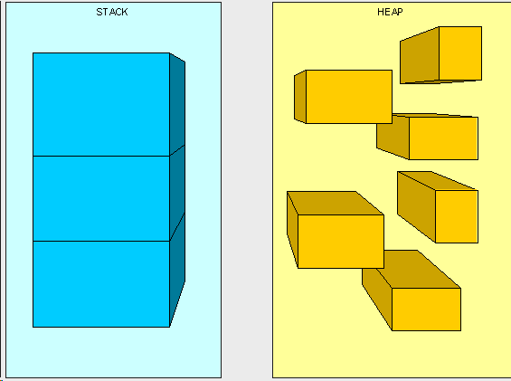
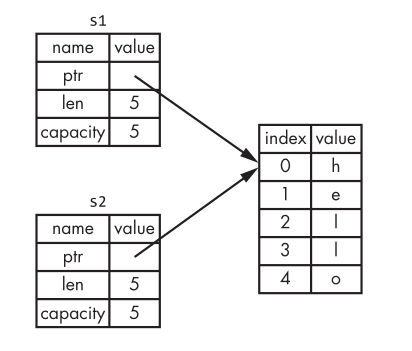
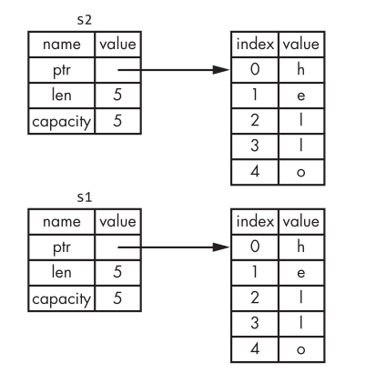

# Chapter 4: understanding Ownership

Ownership enables Rust to make memory safety guarantees without needing a garbage collector. \
Inside this chapter we'll discuss about ownership aswell as several related features:
- borrowing
- slkices
- how Rust lays data out in memory

## What is Ownership?

Some languages have garbage collectors that constantly checks for no longer used memory at runtime, others delegate the developer to aloocate and free the memory manually. \
Rust uses a third approach: memory is managed through a system of ownership with a set of rules that the compiler checks at compile time (it does not slow down your program while it's running). 

### The Stack and the Heap

In many programming languages, you don’t have to think about the stack and the heap very often. But in a systems programming language like Rust, whether a value is on the stack or the heap has more of an effect on how the language behaves and why you have to make certain decisions. Parts of ownership will be described in relation to the stack and the heap later in this chapter, so here is a brief explanation in preparation. \
Both the stack and the heap are parts of memory that is available to your code to use at runtime, but they are structured in different ways. The stack stores values in the order it gets them and removes the values in the opposite order. 
This is referred to as last in, first out. \
Think of a stack of plates: when you add more plates, you put them on top of the pile, and when you need a plate, you take one off the top. Adding or removing plates from the middle or bottom wouldn’t work as well! \
Adding data is called pushing onto the stack, and removing data is called popping off the stack.



The stack is fast because of the way it accesses the data: it never has to search for a place to put new data or a place to get data from because that place is always the top. \
Another property that makes the stack fast is that all data on the stack must take up a known, fixed size.

Data with a size unknown at compile time or a size that might change can be stored on the heap instead. \
The heap is less organized: when you put data on the heap, you ask for some amount of space. The operating system finds an empty spot somewhere in the heap that is big enough, marks it as being in use, and returns a pointer, which is the address of that location. \
This process is called allocating on the heap, sometimes abbreviated as just “allocating”. \
Pushing values onto the stack is not considered allocating. Because the pointer is a known, fixed size, you can store the pointer on the stack, but when you want the actual data, you have to follow the pointer.

## Ownership rules

Those are the three fundamentals rules about ownership to keep in mind:
- Each value in Rust has a variable that's called its owner;
- There can be only one owner at a time;
- When the owner goes out of scope, the value will be dropped.

### Variable Scope

A scope is the range within a program for which an item is valid. \
Let’s say we have a variable that looks like this:
```rust
let s = "hello";
```
The variable 's' refers to a string literal, where the value of the string
is hardcoded into the text of our program. The variable is valid from the
point at which it’s declared until the end of the current scope.
```rust
{               // s is not valid here; s not yet declared
    let s = "hello";  // s is valid from this point forward
    
    // do stuff with s
}               // this scope is now over,s is no longer valid
```

There are 2 important points in time here:
- When 's' comes into scope, it is valide;
- It remain valid until it goes out of scope.

With these in mind, we can build on top the String type;

### The String type

The types covered previously are all stored on the stack and popped off the stack when their scope is over, but we want to look at data that is stored on the heap and explore how Rust knows when to clean up that data. \
We’ve already seen string literals, where a string value is hardcoded into
our program. String literals are convenient, but they aren’t suitable for every
situation in which we may want to use text. 

One reason is that they’re immutable. Another is that not every string value can be known when we write
our code: for example, what if we want to take user input and store it? For
these situations, Rust has a second string type, String. \
This type is allocated on the heap and as such is able to store an amount of text that is unknown to us at compile time.

We can create a String from a string literal using the from function:
```rust
let s = String::from("hello");
```

Obviuously the '::' means that we are using the 'from()' function within the String type; \
This kind of string can be mutated:
```rust
let mut s = String::from("hello");

s.push_str(", world!"); // push_str() appends a literal to a String

println!("{}", s); // this will print `hello, world!`
```

Why can String be mutated but literals cannot? The difference is how these two types deal with memory.

## Memory and Allocation

String literals are fast and efficient because everything about them is known at compile time, with the String type we need to allocate a blob of memory on the heap, unknown at compile time, to hold the contents meaning;
- The memory mus be requested from the operating system at runtime;
- We need a way of returnin this memory to the operating system when we're done.

The first part is done by us when calling 'String::from', while the second one is the most interesting one; \
Rust takes a different path: the memory is automatically returned once
the variable that owns it goes out of scope. Here’s a version of our scope
example using a String instead of a string literal:
```rust
{
    let s = String::from("hello"); // s is valid from this point forward
    
    // do stuff with s
}
    // this scope is now over, and s is no longer valid
```

When a variable goes out of scope, Rust calls a special function for us. \
This function is called 'drop', and it’s where the author of String can put the code to return the memory. Rust calls drop automatically at the closing curly bracket.

### Ways that Variables and Data interact: Move

Multiple variables can interact with the same data in different ways in Rust. \
Let’s look at an example using an integer:

```rust
let x = 5;
let y = x;
```
This is simple because integers have a fixed sized and the two '5' values are pushed on the stack, but with String:
```rust
let s1 = String::from("hello");
let s2 = s1;
```
A String is made up of three parts, shown on the left: a pointer to
the memory that holds the contents of the string, a length, and a capacity. \
This group of data is stored on the stack. On the right is the memory on the
heap that holds the contents.

When we assign s1 to s2, the bound to s1 String data is copied, meaning we
copy the pointer, the length, and the capacity that are on the stack. \
We do not copy the data on the heap that the pointer refers to. In other words, the data representation in memory looks like this: 



And not like this:



This is called deep copy and can be very expensive in term of runtime performance if the data on the heap were very large!

