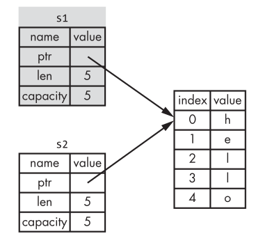
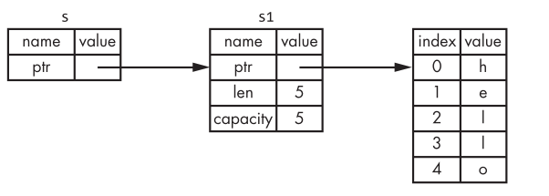
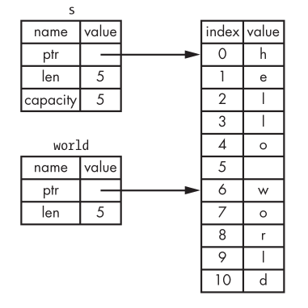

# Chapter 4: understanding Ownership

Ownership enables Rust to make memory safety guarantees without needing a garbage collector. \
Inside this chapter we'll discuss about ownership aswell as several related features:
- borrowing
- slkices
- how Rust lays data out in memory

## What is Ownership?

Some languages have garbage collectors that constantly checks for no longer used memory at runtime, others delegate the developer to aloocate and free the memory manually. \
Rust uses a third approach: memory is managed through a system of ownership with a set of rules that the compiler checks at compile time (it does not slow down your program while it's running). 

### The Stack and the Heap

In many programming languages, you don’t have to think about the stack and the heap very often. But in a systems programming language like Rust, whether a value is on the stack or the heap has more of an effect on how the language behaves and why you have to make certain decisions. Parts of ownership will be described in relation to the stack and the heap later in this chapter, so here is a brief explanation in preparation. \
Both the stack and the heap are parts of memory that is available to your code to use at runtime, but they are structured in different ways. The stack stores values in the order it gets them and removes the values in the opposite order. 
This is referred to as last in, first out. \
Think of a stack of plates: when you add more plates, you put them on top of the pile, and when you need a plate, you take one off the top. Adding or removing plates from the middle or bottom wouldn’t work as well! \
Adding data is called pushing onto the stack, and removing data is called popping off the stack.


The stack is fast because of the way it accesses the data: it never has to search for a place to put new data or a place to get data from because that place is always the top. \
Another property that makes the stack fast is that all data on the stack must take up a known, fixed size.

Data with a size unknown at compile time or a size that might change can be stored on the heap instead. \
The heap is less organized: when you put data on the heap, you ask for some amount of space. The operating system finds an empty spot somewhere in the heap that is big enough, marks it as being in use, and returns a pointer, which is the address of that location. \
This process is called allocating on the heap, sometimes abbreviated as just “allocating”. \
Pushing values onto the stack is not considered allocating. Because the pointer is a known, fixed size, you can store the pointer on the stack, but when you want the actual data, you have to follow the pointer.

## Ownership rules

Those are the three fundamentals rules about ownership to keep in mind:
- Each value in Rust has a variable that's called its owner;
- There can be only one owner at a time;
- When the owner goes out of scope, the value will be dropped.

### Variable Scope

A scope is the range within a program for which an item is valid. \
Let’s say we have a variable that looks like this:
```rust
let s = "hello";
```
The variable 's' refers to a string literal, where the value of the string
is hardcoded into the text of our program. The variable is valid from the
point at which it’s declared until the end of the current scope.
```rust
{               // s is not valid here; s not yet declared
    let s = "hello";  // s is valid from this point forward
    
    // do stuff with s
}               // this scope is now over,s is no longer valid
```

There are 2 important points in time here:
- When 's' comes into scope, it is valide;
- It remain valid until it goes out of scope.

With these in mind, we can build on top the String type;

### The String type

The types covered previously are all stored on the stack and popped off the stack when their scope is over, but we want to look at data that is stored on the heap and explore how Rust knows when to clean up that data. \
We’ve already seen string literals, where a string value is hardcoded into
our program. String literals are convenient, but they aren’t suitable for every
situation in which we may want to use text. 

One reason is that they’re immutable. Another is that not every string value can be known when we write
our code: for example, what if we want to take user input and store it? For
these situations, Rust has a second string type, String. \
This type is allocated on the heap and as such is able to store an amount of text that is unknown to us at compile time.

We can create a String from a string literal using the from function:
```rust
let s = String::from("hello");
```

Obviuously the '::' means that we are using the 'from()' function within the String type; \
This kind of string can be mutated:
```rust
let mut s = String::from("hello");

s.push_str(", world!"); // push_str() appends a literal to a String

println!("{}", s); // this will print `hello, world!`
```

Why can String be mutated but literals cannot? The difference is how these two types deal with memory.

## Memory and Allocation

String literals are fast and efficient because everything about them is known at compile time, with the String type we need to allocate a blob of memory on the heap, unknown at compile time, to hold the contents meaning;
- The memory mus be requested from the operating system at runtime;
- We need a way of returnin this memory to the operating system when we're done.

The first part is done by us when calling 'String::from', while the second one is the most interesting one; \
Rust takes a different path: the memory is automatically returned once
the variable that owns it goes out of scope. Here’s a version of our scope
example using a String instead of a string literal:
```rust
{
    let s = String::from("hello"); // s is valid from this point forward
    
    // do stuff with s
}
    // this scope is now over, and s is no longer valid
```

When a variable goes out of scope, Rust calls a special function for us. \
This function is called 'drop', and it’s where the author of String can put the code to return the memory. Rust calls drop automatically at the closing curly bracket.

### Ways that Variables and Data interact: Move

Multiple variables can interact with the same data in different ways in Rust. \
Let’s look at an example using an integer:

```rust
let x = 5;
let y = x;
```
This is simple because integers have a fixed sized and the two '5' values are pushed on the stack, but with String:
```rust
let s1 = String::from("hello");
let s2 = s1;
```
A String is made up of three parts, shown on the left: a pointer to
the memory that holds the contents of the string, a length, and a capacity. \
This group of data is stored on the stack. On the right is the memory on the
heap that holds the contents.

When we assign 's1' to 's2', the bound to 's1' String data is copied, meaning we
copy the pointer, the length, and the capacity that are on the stack. \
We do not copy the data on the heap that the pointer refers to. In other words, the data representation in memory looks like this: 


And not like this:


This is called deep copy and can be very expensive in term of runtime performance if the data on the heap were very large!

When 's1' and 's2' go out of scope, as we said earlier, Rust should try to free the memory for both of them but, because they are pointing to the same data it'll cause a "double free error" leading to potential security vulnerabilites;

In reality, iknstead of trying to copy the allocated memory, Rust
considers 's1' to no longer be valid and, therefore, Rust doesn’t need to free
anything when 's1' goes out of scope. \
Check out what happens when you try to use 's1' after 's2' is created; it won’t work:
```rust
let s1 = String::from("hello");
let s2 = s1;

println!("{}, world!", s1);
```

You’ll get an error like this because Rust prevents you from using the
invalidated reference:
`let s2 = s1;
|
-- value moved here
println!("{}, world!", s1);
|
^^ value used here after move`

So, this is the representation of what actually lie in the memory after those previous operations:



Before we compared these scope behaviors as the 'shallow' and 'deep' copy, but this isn't actually the case: Rust also invalidates the first variable, instead of being called a shallow copy, it’s known as a **move**. \
In this example, we would say that 's1' was **moved** into 's2'.

That solves our problem! With only 's2' valid, when it goes out of scope, it alone will free the memory, and we’re done.

Rust will never automatically create “deep” copies of your data. \
Therefore, any automatic copying can be assumed to be inexpensive in terms of runtime
performance.

### Ways that Variables and Data interact: Clone

If we do want to deeply copy the heap data of the String, not just the stack data we can use a common method called "clone()"; \
Here’s an example of the clone method in action:
```rust
let s1 = String::from("hello");
let s2 = s1.clone();

println!("s1 = {}, s2 = {}", s1, s2);
```

This works just fine and produces this as a result:


### Stack-only Data: Copy

This code using integers works and is valid:

```rust
let x = 5;
let y = x;

println!("x = {}, y = {}", x, y);
```

We don’t have a call to "clone()", but 'x' is still valid and wasn’t moved into 'y': the reason is that types such as integers that have a known size at compile time are stored entirely on the stack, so copies of the actual values are
quick to make. \
That means there’s no reason we would want to prevent 'x'
from being valid after we create the variable 'y'. In other words, there’s no difference between deep and shallow copying here, so calling "clone()" wouldn’t do
anything different from the usual shallow copying and we can leave it out.

If a type has the "Copy" trait, an older variable is still usable
after assignment. \
Rust won’t let us annotate a type with the "Copy" trait if the
type, or any of its parts, has implemented the "Drop" trait.

Here are some of the types that are Copy:
- All the integer type (such as u32)
- The Boolean type, with true and false
- The character type, 'char'
- All the floating point types, such as f64
- Tuples, but only if they contain types that are also Copy

## Ownership and Functions

Passing a variable to a function will move or copy, just as assignment does.
Here is a detailed example:
```rust
fn main() {
    let s = String::from("hello");  // s comes into scope
    
    takes_ownership(s);             // s's value moves into the function...
                                    // ... and so is no longer valid here
    let x = 5;                      // x comes into scope
    
    makes_copy(x);                  // x would move into the function,
                                    // but i32 is Copy, so it's okay to
                                    // still use x afterward
    } // Here, x goes out of scope, then s. But because s's value was moved,
        // nothing special happens.
    
fn takes_ownership(some_string: String) {       // some_string comes into scope
    println!("{}", some_string);
}                   // Here, some_string goes out of scope and `drop` is called. The backing memory is freed

fn makes_copy(some_integer: i32) { // some_integer comes into scope
    println!("{}", some_integer);
}          // Here, some_integer goes out of scope. Nothing special happens.
```

If we tried to use s after the call to "takes_ownership()", Rust would throw a
compile-time error. These static checks protect us from mistakes.

## Return Values and Scope

Returning values can also transfer ownership.\
Here is an example:
```rust
fn main() {
    let s1 = gives_ownership();         // gives_ownership moves its return
                                        // value into s1

    let s2 = String::from("hello");     // s2 comes into scope

    let s3 = takes_and_gives_back(s2);  // s2 is moved into
                                        // takes_and_gives_back, which also
                                        // moves its return value into s3
} // Here, s3 goes out of scope and is dropped. s2 goes out of scope but was
// moved, so nothing happens. s1 goes out of scope and is dropped.

fn gives_ownership() -> String {        // gives_ownership will move its
                                        // return value into the function
                                        // that calls it

    let some_string = String::from("hello");    // some_string comes into scope
    
    some_string                                 // some_string is returned and
                                                // moves out to the calling function
}

// takes_and_gives_back will take a String and return one
fn takes_and_gives_back(a_string: String) -> String {   // a_string comes into
                                                        // scope
    a_string         // a_string is returned and moves out to the calling function
}
```

The ownership of a variable follows the same pattern every time: assigning a value to another variable moves it.\
When a variable that includes data on the heap goes out of scope, the value will be cleaned up by drop unless the data has been moved to be owned by another variable.

Taking ownership and then returning ownership with every function is
a bit tedious. What if we want to let a function use a value but not take ownership?\
It’s quite annoying that anything we pass in also needs to be passed back if we want to use it again, in addition to any data resulting from the body of the function that we might want to return as well.

It’s possible to return multiple values using a tuple, as shown: 
```rust
fn main() {
    let s1 = String::from("hello");
    let (s2, len) = calculate_length(s1);
    println!("The length of '{}' is {}.", s2, len);
}

fn calculate_length(s: String) -> (String, usize) {
    let length = s.len(); // len() returns the length of a String
    (s, length)
}
```

It's still a bit tedious, but luckily for us Rust has a feature called **references**.

## References and Borrowing

The issue with the last example, which required us to use a tuple to return both the String and its calculated length is that we have to actively manage the returning of the original String to allow it to be used even after the "calculate_length()" function.\
Here is how you would define and use a "calculate_length()" function that
has a reference to an object as a parameter instead of taking ownership of
the value:
```rust
fn main() {
    let s1 = String::from("hello");
    let len = calculate_length(&s1);
    println!("The length of '{}' is {}.", s1, len);
}

fn calculate_length(s: &String) -> usize { // s is a reference to a String
    s.len()
} // Here, s goes out of scope. But because it does not have ownership of what it refers to, nothing happens
```

These ampersands are references, and they allow you to refer to some
value without taking ownership of it.\
For better understanding:



The '&s1' syntax lets us create a reference that refers to the value of 's1' but
does not own it. Because it does not own it, the value it points to will not be
dropped when the reference goes out of scope.\
Likewise, the signature of the function uses & to indicate that the type
of the parameter 's' is a reference.

We call having references as function parameters **borrowing**. As in real
life, if a person owns something, you can borrow it from them. When you’re
done, you have to give it back.

Therefore if we try to modify something while borrowing, by default nothing happens:
```rust
fn main() {
    let s = String::from("hello");
    change(&s);
}
fn change(some_string: &String) {
    some_string.push_str(", world");
}
```

Giving us this error: `error[E0596]: cannot borrow immutable borrowed content *some_string as mutable`, `use &mut String here to make mutable`

As we were discussing earlier variables are immutable by default, so are references!

### Mutable references

We can fix the error in the code above with just a small tweak:
```rust
fn main() {
    let mut s = String::from("hello");
    change(&mut s);
}
fn change(some_string: &mut String) {
    some_string.push_str(", world");
}
```

First, we had to change 's' to be mut. Then we had to create a mutable ref-
erence with '&mut s' and accept a mutable reference with 'some_string: &mut String'.

But mutable references have one big restriction: you can have only one
mutable reference to a particular piece of data in a particular scope.\
This code will fail:
```rust
let mut s = String::from("hello");

let r1 = &mut s;
let r2 = &mut s;
```

Giving us this error: `error[E0499]: cannot borrow s as mutable more than once at a time`, `second mutable borrow occurs here`.

The benefit of having this restriction is that Rust can prevent data races
at compile time. \
A data race is similar to a race condition and happens when these three behaviors occur:
- two or more pointers access the same data at the same time;
- at least one of the pointers is being used to write to the data;
- there’s no mechanism being used to synchronize access to the data.

Data races cause undefined behavior and can be difficult to diagnose and fix.\
Rust prevents this problem from happening because it won’t even compile code with data races.

We can use curly brakets to create a new scope allowing for multiple mutable references just not simultaneous ones:
```rust
let mut s = String::from("hello");

    {
    let r1 = &mut s;
    } // r1 goes out of scope here, so we can make a new reference with no problems
    
let r2 = &mut s;
```

A similar behavior happens when trying to combine mutable and immutable references leading to an error:
```rust
let mut s = String::from("hello");

let r1 = &s; // no problem
let r2 = &s; // no problem
let r3 = &mut s; // BIG PROBLEM
```

Giving us this error: `error[E0502]: cannot borrow s as mutable because it is also borrowed as immutable`, `mutable borrow occurs here`.

## Dangling References

It’s easy to erroneously create a **dangling pointer**,
a pointer that references a location in memory that may have been given to
someone else, by freeing some memory while preserving a pointer to that
memory.

In Rust, by contrast, the compiler guarantees that references will
never be dangling references: if you have a reference to some data, the compiler will ensure that the data will not go out of scope before the reference
to the data does.

Forcing it to happen we can see:
```rust
fn main() {
    let reference_to_nothing = dangle();
}

fn dangle() -> &String {       // dangle returns a reference to a String

    let s = String::from("hello");  // s is a new String

    &s      // we return a reference to the String, s

}   // Here, s goes out of scope, and is dropped. Its memory goes away. Danger!
```

Because s is created inside dangle, when the code of dangle is finished, s
will be deallocated. But we tried to return a reference to it. \
That means this reference would be pointing to an invalid String. That’s no good! Rust won’t let us do this.

The solution here is to return the String directly:
```rust
fn no_dangle() -> String {
    let s = String::from("hello");

    s
}
```

### Rules of References 

Recap:
- at any given time, you can have either but not both of the following: one
mutable reference or any number of immutable references;
- references must always be valid.

## String Slices

A string slice is a reference to part of a String, and it looks like this:
```rust
let s = String::from("hello world");

let hello = &s[0..5];
let world = &s[6..11];
```

Rather than a reference to the entire String, it’s a reference
to a portion of the String.\
The "start..end" syntax is a range that begins at start and continues up to, but not including, end.

This is how a String Slice is actually handled: 



If you want to start at the first index (zero) you can omit the first 0 in the range syntax, if your slice includes the last byte of the String, you
can drop the trailing number.

```rust
let s = String::from("hello");

// These are equal
let slice = &s[0..2];
let slice = &s[..2];
```

```rust
let s = String::from("hello");

let len = s.len();

// These are equal
let slice = &s[3..len];
let slice = &s[3..];
```

### String Literals are Slices

The type of 's' here is '&str': it’s a slice pointing to that specific point of
the binary. \
This is also why string literals are immutable; '&str' is an immutable reference.

```rust
let s = "Hello, world!";
```

### String Slices as Parameters

Knowing that you can take slices of literals and String values leads us to one
more improvement on first_word, and that’s its signature:
```rust
fn first_word(s: &String) -> &str {
```
can become 
```rust
fn first_word(s: &str) -> &str {
```
because if we have a string slice, we can pass that directly.\
If we have a String, we can pass a slice of the entire String.

```rust
fn main() {
    let my_string = String::from("hello world");

    // first_word works on slices of `String`s
    let word = first_word(&my_string[..]);

    let my_string_literal = "hello world";

    // first_word works on slices of string literals
    let word = first_word(&my_string_literal[..]);

    // Because string literals *are* string slices already,
    // this works too, without the slice syntax!
    let word = first_word(my_string_literal);
}
```

### Other Slices

```rust
let a = [1, 2, 3, 4, 5];

let slice = &a[1..3];
```

This slice has the type '&[i32]'.\
It works the same way as string slices do, by storing a reference to the first element and a length. 
You’ll use this kind of slice for all sorts of other collections.