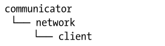

# Using Modules to reuse and organize code

A module is a namespace that contains definitions of functions ortypes, and you can choose whether those definitions are visible outside their
module (public) or not (private). 

Here’s an overview of how modules work:
- The 'mod' keyword declares a new module. Code within the module
appears either immediately following this declaration within curly
brackets or in another file.
- By default, functions, types, constants, and modules are private. The
'pub' keyword makes an item public and therefore visible outside its
namespace.
- The 'use' keyword brings modules, or the definitions inside modules,
into scope so it’s easier to refer to them.

## mod and the Filesystem

We'll start our example by making a new project with Cargo using '--lib' which creates a library crate: a project that other people can pull into their projects as a dependency.

We’ll create a skeleton of a library that provides some general networking functionality; we’ll concentrate on the organization of the modules and
functions, but we won’t worry about what code goes in the function bodies.

In this case we created the 'communicator/' folder.

### Module definitions

We’ll first define a module named
network that contains the definition of a function called connect. Every module definition in Rust starts with the 'mod' keyword.

After the 'mod' keyword, we put the name of the module, network, and
then a block of code in curly brackets. Everything inside this block is inside
the namespace network. In this case, we have a single function named 'connect'.

We can also have multiple modules, side by side, in the same 'src/lib.rs'
file.

In our example now we have 'network::connect()' and 'client::connect()' which could have completely different functionalities, and names do not conflict because they're in two different modules.

We can also put modules inside of modules, which can be useful as your modules grow to keep related functionality organized together and separate functionality apart.

The client code and its 'connect' function might make more sense to users of our library if they were inside the network namespace instead. 

```rust
mod network {
    fn connect() {
    }

    mod client {
        fn connect() {
        }
    }
}
```

The functions 'network::connect()' and 'network::client::connect()'
are both named connect, but still they don’t conflict with each other because
they’re in different namespaces.



### Moving modules to other files